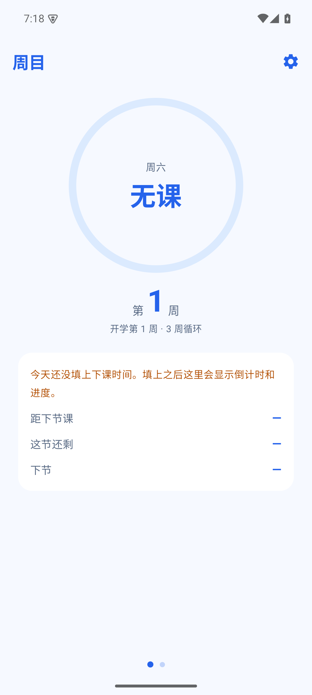
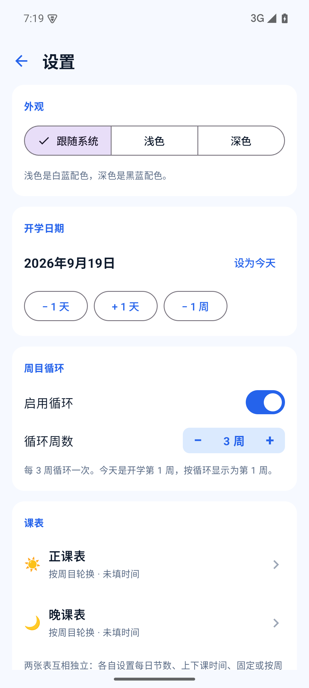
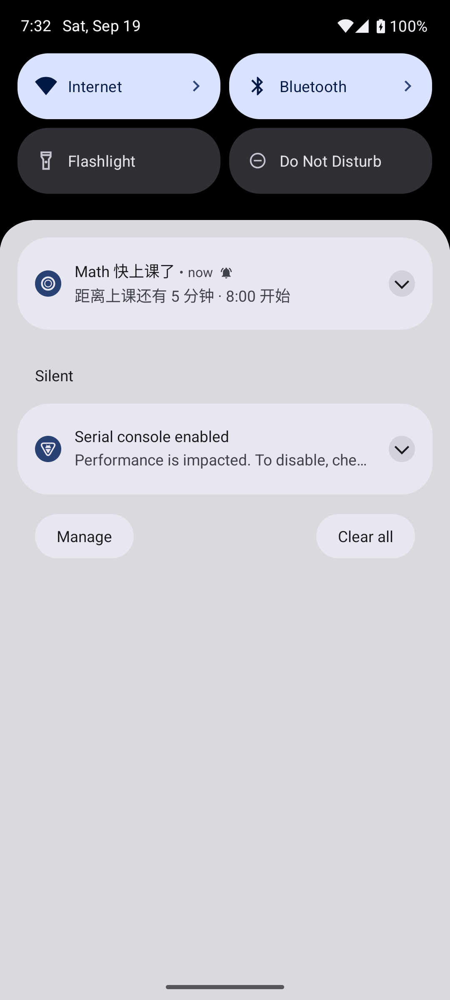

# 周目 · Android 版

**打开就知道今天是第几周、今天上什么课。**

这是 [周目](https://github.com/zhoumu-app/zhoumu) 家族的 Android 版，和 iOS 版功能一致，
只是去掉了 iPhone 上特有的灵动岛（Android 没有这东西）。

浅色白蓝、深色黑蓝，**不联网、不要账号、不收集任何数据**。

| 首页 | 设置 | 上下课提醒 |
| :---: | :---: | :---: |
|  |  |  |

> Android 模拟器（Pixel 6 / Android 15，1080×2400）实拍。

---

## 下载安装

到 **[Releases](https://github.com/zhoumu-app/zhoumu-android/releases/latest)** 下载 `ZhouMu-x.x-android.apk`，
直接装就行（已经签好名了，不需要再自签）。

- **需要 Android 8.0（API 26）或更高**
- 装完第一次打开会问通知权限 —— **不给的话上下课提醒用不了**（其他功能正常）
- Android 12 及以上还可能要「闹钟和提醒」权限，同样是为了让提醒准时响

### 关于签名

APK 用仓库里的 `keystore/zhoumu.jks` 签名，**密码是公开的**（`zhoumu2026`）。

为什么公开：这样所有人装到的都是同一个签名的包，以后出新版能**直接覆盖升级**；
如果每次换密钥签，Android 会拒绝安装签名不一致的更新。

代价是别人也能签一个同名包。**想确认来源可信，请自己从源码编译**，
或者对比 Release 里附的 `sha256`：

```bash
shasum -a 256 ZhouMu-1.5-android.apk
```

---

## 功能

### 周目

- **打开直接显示**：圈内是当前科目，圈下面是第 N 周，圆环按**课程完成进度**填充。
- **开学日期**：以这天为第 1 周的第 1 天，每 7 天进入下一周。
- **周目循环**：开启后按 N 周循环显示（N 可选 1–20 周）。

### 两张课表

- **正课表** 与 **晚课表**互相独立，可各自开启或**单独关闭**。
- 覆盖周一至周日，**每天节数可以不一样**（1–12 节）。
  改节数的加减控件上**直接显示当前是几节**，到上下限时按钮会变灰。
- 每张表可以选 **固定**（每周同一份）或 **按周目轮换**（每周换一排）。
- 每格只有「无」和「自定义」两个选项。
- 每节可**选填上下课时间**——不填也能用，只是不参与时间轴和提醒。
  时间可以**所有天共用一套**（统一），也可以**每天各设一套**（每天单独）。

### 首页两页

- **第一页**：圆环 + 周目 + 三行信息 —— 距下节课还有多久 / 这节还有多久结束 / 下节是什么。
- **第二页**：当天完整课表，当前这节高亮标「进行中」。
- 圆环在上课时按本节进度走，**课间休息时环是闭合的**，每节课结束后重新开始。

### 桌面小组件

不打开 App 也能看到第 N 周和今天的前三节课。

### 上下课提醒

- **每节课上课前、下课前各提醒一次**，可以设置提前几分钟（默认 5 分钟）。
- 用系统精确闹钟，**App 没开着也会响**。

### 外观

- **浅色 / 深色 / 跟随系统** 三态切换。

---

## 和 iOS 版的区别

| | iOS 版 | Android 版 |
| --- | --- | --- |
| 周目计算 | 有 | 有（**算法完全一致**） |
| 两张课表 / 每日节数 / 时间 | 有 | 有 |
| 首页两页 | 有 | 有 |
| 桌面小组件 | 有 | 有 |
| 上下课提醒 | 有 | 有 |
| **灵动岛 / 实时活动** | 有 | **没有**（Android 没这东西） |
| Apple Watch | 有 | 没有 |
| 锁屏卡片 | 有 | 没有 |

### 为什么算法能保证一致

核心逻辑（`SemesterCalculator.kt` / `ScheduleModel.kt`）是从 iOS 版逐行移植的，
单元测试里的断言也和 iOS 版 `Tools/CalculatorCheck` 一一对应。
两边算出来的周目、时间轴、进度**必须一样**。

---

## 验证情况

在 **Android 15 模拟器（Pixel 6）** 上实测过的：

| 项目 | 结果 |
| :--- | :--- |
| 18 项单元测试 | ✅ 全过（断言和 iOS 版 `Tools/CalculatorCheck` 一一对应） |
| Debug APK 编译 | ✅ minSdk 26 / targetSdk 35 |
| 首页 | ✅ 圆环、第 N 周、三行倒计时都正常 |
| 设置页 | ✅ 外观三态、开学日期、循环、两张课表、提醒 |
| 课表编辑器 | ✅ 每日节数、**统一 / 每天单独**切换、时间、科目 |
| 数据持久化 | ✅ 重启 App 后设置还在（直接读 DataStore 确认过） |
| **上下课提醒** | ✅ **闹钟真的排进了系统**（`dumpsys alarm` 里两个 `ReminderReceiver`，相差正好 45 分钟 = 课程时长），**通知也真的弹出来了**（见上图） |
| 通知渠道 | ✅ `zhoumu.class`，importance=4（HIGH） |

**实测中抓到并修掉的三个 bug**：

1. **改完课表不会重排提醒** —— `reschedule()` 原本只在 App 启动时调一次，
   结果加完课表闹钟还是空的。现在监听设置变化，一变就重排。
2. **时间对话框的分钟加减被挤出屏幕** —— 小时和分钟两个控件并排放不下。
   改成上下两行。
3. **通知根本不弹** —— `setSmallIcon()` 用了 `android.R.drawable` 的系统图标，
   Android 要求小图标必须是本 App 的资源，用系统的会被**静默丢弃**。
   更坑的是我还用 `runCatching` 把异常吞了，什么都没报。
   现在换成自己的矢量图标，并且改成显式 catch + 打日志。

**还没验证的**：

- **桌面小组件**：只验证了编译通过，没实际加到桌面上看过。
  模拟器上加小组件要走启动器的长按菜单，自动化比较麻烦。

## 自己编译

需要 JDK 17+ 和 Android SDK（compileSdk 35）。

```bash
# 指向你的 Android SDK
echo "sdk.dir=/path/to/android-sdk" > local.properties

# 编译 Debug 包
./gradlew :app:assembleDebug

# 跑单元测试
./gradlew :app:test

# 一键校验（编译 + 测试）
./Tools/verify.sh

# 打签好名的 Release APK（放到 build/ 根目录）
./Tools/make_apk.sh
```

摸不到 Android SDK 的话，至少可以单独跑核心逻辑的测试：

```bash
./gradlew :app:test --tests '*SemesterCalculatorTest*'
```

---

## 项目结构

```
app/src/main/java/com/zhoumu/android/
  MainActivity.kt              入口
  ZhoumuApplication.kt         建通知渠道 + 排提醒
  data/
    SemesterCalculator.kt      周目计算（和 iOS 版算法一致）
    ScheduleModel.kt           课表模型 + 时间轴 + 状态机
    SettingsRepository.kt      设置读写（DataStore）
  ui/
    ZhoumuApp.kt               导航
    theme/                     蓝色主题（浅色 / 深色）
    screens/
      HomeScreen.kt            首页两页 + 圆环
      SettingsScreen.kt        设置
      ScheduleEditorScreen.kt  课表编辑器
  notify/
    ClassReminders.kt          精确闹钟 + 通知
  widget/
    WeekWidget.kt              桌面小组件（Glance）
app/src/test/                  单元测试
Tools/verify.sh                一键校验
```

---

## 许可证

[MIT](LICENSE)
